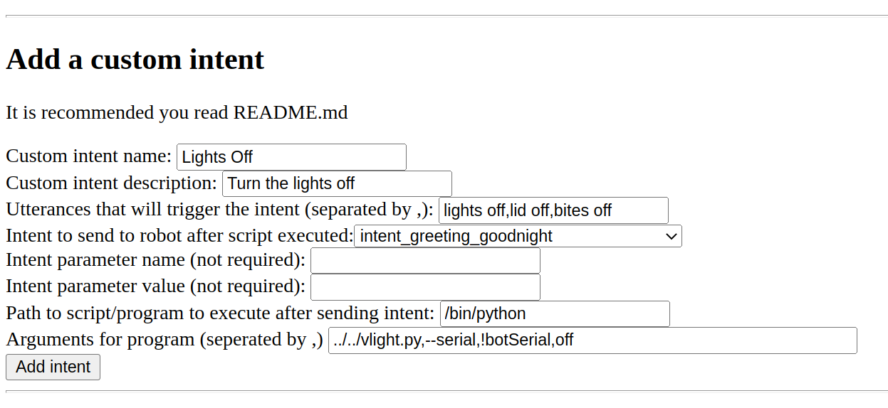

# wire-picovoice-pod

This repo contains a custom Vector escape pod made from [chipper](https://github.com/digital-dream-labs/chipper) and [vector-cloud](https://github.com/digital-dream-labs/vector-cloud).

This repo is a copy of [wire-pod](https://github.com/kercre123/wire-pod) but instead of using Coqui STT, it uses Picovoice. Picovoice's services are faster, more accurate, and supports more hardware than Coqui, but it is not a totally local solution (processing is done locally, but it uploads usage to a server). The Coqui STT version will still be developed alongside this.

## Program descriptions

`chipper` - Chipper is a program used on Digital Dream Lab's servers which takes in a Vector's voice stream, puts it into a speech-to-text processor, and spits out an intent. This is the same program powering the official escape pod. This repo contains an older tree of chipper which does not have the "intent graph" feature due to it causing an error upon every new stream.

`vector-cloud` - Vector-cloud is the program which runs on Vector himself which uploads the mic stream to a chipper instance. This repo has an older tree of vector-cloud which also does not have the "intent graph" feature and has been modified to allow for a custom CA cert.

## Configuring, installing, running

NOTE: This only works with OSKR-unlocked, Dev-unlocked, or Whiskey robots running VicOS version 1.4 and above.

### Linux

(This currently only works on Arch or Debian-based Linux)

```
cd ~
git clone https://github.com/kercre123/wire-picovoice-pod.git
cd wire-picovoice-pod
sudo ./setup.sh

# You should be able to just press enter for all of the settings
```

Now install the files created by the script onto the bot:

`sudo ./setup.sh scp <vectorip> <path/to/key>`

Example:

`sudo ./setup.sh scp 192.168.1.150 /home/wire/id_rsa_Vector-R2D2`

If you are on my custom software (WireOS), you do not have to provide an SSH key,

Example:

`sudo ./setup.sh scp 192.168.1.150`

The bot should now be configured to communicate with your server. You do not need to restart the bot to start using voice commands with the new server environment, but you will need to restart him at some point for weather commands to be reliable.

To start wire-picovoice-pod, run:

```
cd chipper
sudo ./start.sh
```

To stop wire-picovoice-pod, press CTRL+C with the terminal window on top.

#### Update

To update to a newer version of wire-picovoice-pod, make sure chipper is not running then run:
```
cd ~/wire-picovoice-pod
sudo git pull
cd chipper
sudo ./start.sh
```
If you see an error, run the command it tells you to run but with `sudo` at the beginning of the command. Then run `sudo ./start.sh` again.

#### Systemd daemon

You can setup a systemd daemon for wire-picovoice-pod. This allows it to run in the background and it to run automatically at startup.
```
cd ~/wire-picovoice-pod
sudo ./setup.sh daemon-enable
```
To start the service, either restart your computer or run:

`sudo systemctl start wire-picovoice-pod`

To see logs, run:

`journalctl -fe | grep start.sh`

If you would like to disable the daemon, run:
```
cd ~/wire-picovoice-pod
sudo ./setup.sh daemon-disable
```

### Windows 10/11

1. Install WSL (Windows Subsystem for Linux)
	- Open Powershell
	- Run `wsl --install`
	- Reboot the system
	- Run `wsl --install -d Ubuntu-20.04`
	- Open up Ubuntu 20.04 in start menu and configure it like it says.
2. Find IP address
	- Open Powershell
	- Run `ipconfig`
	- Find your computer's IPv4 address and note it somewhere. It usually starts with 10.0. or 192.168.
3. Install wire-picovoice-pod
	- Follow the Linux instructions from above
	- Enter the IP you got from `ipconfig` earlier instead of the one provided by setup.sh
	- Use the default port and do not enter a different one
4. Setup firewall rules
	- Open Powershell
	- Run `Set-ExecutionPolicy`
	- When it asks, enter `Bypass`
	- Download [this file](https://wire.my.to/wsl-firewall.ps1)
	- Go to your Downloads folder in File Explorer and Right Click -> Run as administrator
5. Try a voice command

### macOS 10.15 and above

1. Open Terminal
2. Install required packages
	- Install brew with this command:
	- `/bin/bash -c "$(curl -fsSL https://raw.githubusercontent.com/Homebrew/install/HEAD/install.sh)"`
	- Install required packages with this command:
	- `brew install opusfile opus pkg-config gcc golang`
3. Install wire-picovoice-pod
	- Follow the Linux instructions, located above the Windows instructions
4. Try a voice command

## 0.10-era bots

0.10 and below use raw PCM streams rather than the modern Opus streams. This has support for those streams and no special configuration server-side is required for it. However: you will need to get a domain which is the same length as `chipper-dev.api.anki.com`, make sure to run this on a port that is 3 characters long (like the default 443), add true TLS certificates (can be done in ./chipper/source.sh. make sure to include the chain), and run these commands (SSHed into the bot):

```
cd /anki/bin
systemctl stop vic-cloud
cp vic-cloud orig-vic-cloud
sed -i "s/chipper-dev.api.anki.com:443/<domain>:<port>/g" vic-cloud
systemctl start vic-cloud
```

## Picovoice environment variables

There are many environment variables exported in `./chipper/source.sh`. Here are ones that are not included in that file but can be added.

### PICOVOICE_INSTANCES

- Integer, default is 3. 
- This is how many instances of Picovoice Leopard (or Rhino if you have selected that) get initiated. This is equal to how many bots can be streaming at once to chipper. If the number of bots streaming exceeds this number, it will send `intent_system_noaudio`.

### PICOVOICE_MODE

- String, default is `OnlyCheetah`.

Possible options:
- `OnlyLeopard`
	- Transcribes the voice stream to text and processes that text with a list of utterance matches
- `OnlyRhino`
	- Uses Picovoice Rhino to transcribe the voice stream directly into an intent
	- This is much more accurate than Leopard and Cheetah, but there is a constant list of utterances for each intent which means the following commands don't work because they have a broad argument:
		- "My name is `name`"
		- "I have a question, `question`"
		- "What's the weather in `location`"
		- "Record/play a message for `name`"
	- However, every other command works including:
		- "Set a timer for `time` `units`"
		- "Set your eye color to `color`"
		- "Set your volume to `volume`"
	- With those last three commands there is a known list of possible utterances that can be easily made, but the first three require true speech-to-text to properly parse out what they need for the command to be sent correctly
	- This repo comes included with a completed .rhn file for both amd64 and arm
- `LeopardAndRhino`
	- Uses Picovoice Rhino to transcribe the voice stream directly into an intent, and if it fails, it falls back to Leopard.
	- This used to be the default and is recommended if you are having issues with `OnlyCheetah`, or if you don't plan to setup custom intents and are fine with higher accuracy at the cost of loosing speech to text.
- `OlderPi`
	- Same as `OnlyRhino` and sets `PICOVOICE_INSTANCES` to 1
	- This is meant for less powerful Raspberry Pis like the 3B+ and the Pi Zero 2 W
- `OnlyCheetah`
	- Cheetah supports a mic stream while Leopard doesn't. Leopard has to transcribe all of the PCM data, which means it has to be transcribed up to 20 times per voice request for snappy end-of-speech detection. This is a little wasteful and uses up more seconds of allowed speech (Picovoice's free teir has 360000 seconds per 30 days). With Cheetah, I can just pipe the audio directly into it and it gives transcriptions. In my experience it is also as accurate and as fast as Leopard.

## Web interface

Chipper hosts a web interface at port 8080. This can be used to create custom intents and to configure specific bots.

To get to it, open a browser and go to `http://serverip:8080`, replacing serverip with the IP address of the machine running the chipper server. If you are running the browser on the machine running chipper, you can go to `http://localhost:8080`

- Custom intents
	- Example: You want to create a custom intent that allows Vector to turn the lights off. The transcribed text that matches to this intent should include "lights off" and other variations like "lid off" for better detection. It will execute a python script located in your user directory called `vector-lights-off.py`. This script turns the lights off and connects to Vector so he says "The lights are off!". You have multiple bots registered with the SDK so a serial number must be specified. After the SDK program is complete, chipper should send `intent_greeting_goodnight`. The following screenshot is a correct configuration for this case. The `Add intent` button would be pressed after everything is put in.
	- 
	- The last entry cannot be seen fully here, it contains `../../vector-lights-on.py,--serial,!botSerial`
	- (If `!botSerial` is put into the program arguments, chipper will substitute it for the serial number of the bot that is making a request to it.)
- Bot configurations
	- Example: You have a bot on 1.6 with a serial number of 0060059b; located in Des Moines, Iowa; and you would like to use Fahrenheit for the temperature unit in the weather command. The following screenshot is a correct configuration for that bot. Once that is input, you would press "Add bot". It would then be registered with chipper.
	- 

## Status

### OS Support

- Arch
- Debian/Ubuntu/other APT distros
- Windows 10/11 (WSL only)
- macOS 10.15 or above

### Architecture Support

- amd64/x86_64
- arm64/aarch64
- arm32/armv7l (kinda)

Things wire-picovoice-pod has worked on:

- Raspberry Pi 4B+ 4GB RAM with Raspberry Pi OS
	- Recommended platform, very fast
	- 32-bit support on Pi 4 works, but doesn't on Pi 3
- Raspberry Pi 4B+ 4GB RAM with Manjaro 22.04
- Nintendo Switch with L4T Ubuntu
- Desktop with Ryzen 5 3600, 16 GB RAM with Ubuntu 22.04
- Laptop with mobile i7
- Late 2009 iMac with Core 2 Duo
- Android Devices
	- Pixel 4, Note 4, Razer Phone, Oculus Quest 2, OnePlus 7 Pro, Moto G6, Pixel 2
	- If you run into an error when trying to execute start.sh, please open an issue. This is a Picovoice issue and can be solved by editing the go modules.
	- [Termux](https://github.com/termux/termux-app) proot-distro: Use Ubuntu, make sure to use a port above 1024 and not the default 443.
	- Linux Deploy: Works stock, just make sure to choose the arch that matches your device in settings. Also use a bigger image size, at least 3 GB.

### General notes

- If you get this error when running chipper, you are using a port that is being taken up by a program already: `panic: runtime error: invalid memory address or nil pointer dereference`
	- Run `./setup.sh` with the 5th and 6th option to change the port, you will need to push files to the bot again.
- If you want to disable logging from the voice processor, edit `./chipper/source.sh` and change `DEBUG_LOGGING` to `false`
- There is support for 3 robots at a time (can be increased or decreased with the `PICOVOICE_INSTANCES` variable in `./chipper/source.sh`)

### TODO

- Implement a VAD system in conjunction with Leopard
- Create a way (either webserver or script) to configure specific bots and env vars easily
- Implement custom intents, which maybe launches python scripts

### Current implemented actions (complete!)

- Good robot
- Bad robot
- Change your eye color
- Change your eye color to {color}
	- blue, purple, teal, green, yellow
- How old are you
- Start exploring ("deploring" works better)
- Go home (or "go to your charger")
- Go to sleep
- Good morning
- Good night
- What time is it
- Goodbye
- Happy new year
- Happy holidays
- Hello
- Sign in alexa
- Sign out alexa
- I love you
- Move forward
- Turn left
- Turn right
- Roll your cube
- Pop a wheelie
- Fistbump
- Blackjack (say yes/no instead of hit/stand)
- Yes (affirmative)
- No (negative)
- What's my name
- Take a photo
- Take a photo of me
- What's the weather
	- Requires API setup
	- weatherapi.com is implemented, use the 5th option in `./setup.sh` to set it up
	- To set a default location, use the `botSetup.sh` script in the `./chipper` directory
- What's the weather in {location}
	- Requires API setup
	- weatherapi.com is implemented, use the 5th option in `./setup.sh` to set it up
- Im sorry
- Back up
- Come here
- Volume down
- Be quiet
- Volume up
- Look at me
- Set the volume to {volume}
	- High, medium high, medium, medium low, low
- Shut up
- My name is {name}
- I have a question
	- Requires API setup
	- Houndify is implemented, use the 5th option in `./setup.sh` to set it up
- Set a timer for {time} seconds
- Set a timer for {time} minutes
- Check the timer
- Stop the timer
- Dance
- Pick up the cube
- Fetch the cube
- Find the cube
- Do a trick
- Record a message for {name}
	- Enable `Messaging` feature in Vector's webViz Features tab
- Play a message for {name}
	- Enable `Messaging` feature in Vector's webViz Features tab
- Play keepaway
	- This may only be a feature in 1.5 and lower

## Credits

- [Digital Dream Labs](https://github.com/digital-dream-labs) for saving Vector and for open sourcing chipper which made this possible
- [dietb](https://github.com/dietb) for rewriting chipper and giving tips
- [GitHub Copilot](https://copilot.github.com/) for being awesome
